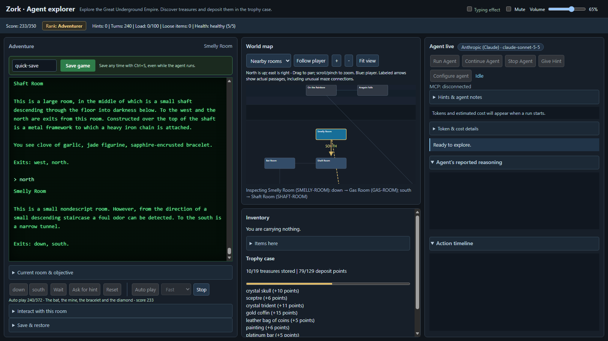

# Auto Zork

Watch an AI play *Zork I*, or play it yourself. The game is a close adaptation of the 1980s text
adventure: 110 rooms, 85 items, the classic puzzles, a troll to fight, a thief that wanders the
underground, and 350 points to earn. A browser dashboard shows the transcript, a map, your inventory
and, when an AI is playing, its reasoning and every action it takes.

- **Any major model.** OpenAI, Anthropic (Claude), Google (Gemini), xAI (Grok) and OpenRouter work out of the box, plus any OpenAI-compatible endpoint.
- **Plays through MCP.** The game is exposed as 14 tools over the Model Context Protocol, so you can also connect your own MCP client.
- **You stay in the loop.** Give the agent hints, read its notes, save at any time, and stop it whenever you like.



## Quick start

You need [uv](https://docs.astral.sh/uv/getting-started/installation/). It installs the right Python
(3.13 or newer) for you. Windows, macOS and Linux all work.

```sh
git clone https://github.com/petershk/auto-zork.git
cd auto-zork/maze
uv sync --locked
uv run python web_app.py
```

The terminal prints the address, `http://127.0.0.1:5000`, and your browser opens it. Set
`MAZE_NO_BROWSER=1` if you would rather open it yourself, and `MAZE_PORT` to change the port.
Press Ctrl+C in the terminal to stop.

### Play it yourself

No key or account is needed. Use the exit buttons, the **Interact with this room** panel and the
inventory. **Ask for hint** nudges you toward your next goal, and the score and rank are at the top.

### Watch a perfect run

Click **Auto play** (under the transcript) to watch a scripted run that earns all 350 points and finishes
the adventure: a few hundred steps through every puzzle, treasure and fight, ending with the walk into the Stone Barrow and the original closing message. Pick **Slow**, **Normal** or **Fast**,
and **Stop** it any time. It needs no API key, starts a new game (it asks first if you have progress),
and you can still save during it. It is also the game's happy-path check:

```sh
cd maze
uv run python autoplay.py            # play it headless and report the result
```

### Let an AI play

1. Click **Configure agent**.
2. Choose a **Provider**, paste your API key and click **Save API key locally**. It is written to `maze/.env`, which is never committed.
3. Click **Load Models** and pick one (model names change often, so this lists what your key can use).
4. Close the dialog and click **Run Agent**.

While it plays you can click **Give Hint** to send it advice, open **Hints & agent notes** to see what it
knows, **Stop Agent** at any time, and **Continue Agent** to resume where it stopped. Agents call a paid
API, so keep an eye on the token and cost estimate in the agent panel.

The **Agent's reported reasoning** panel shows what the model chooses to explain: a few sentences with every
action (what it saw, its plan, why), plus a "(thinking)" summary where the provider returns one (OpenAI
reasoning models, and OpenRouter models that expose their reasoning). Anthropic's own extended thinking is
not available through its OpenAI-compatible endpoint, so Claude shows only what it writes itself.

| Provider | Key variable | Notes |
| --- | --- | --- |
| OpenAI | `OPENAI_API_KEY` | Cost estimates built in for common models |
| Anthropic (Claude) | `ANTHROPIC_API_KEY` | Uses Anthropic's OpenAI-compatible endpoint |
| Google (Gemini) | `GEMINI_API_KEY` | Uses Google's OpenAI-compatible endpoint |
| xAI (Grok) | `XAI_API_KEY` | |
| OpenRouter | `OPENROUTER_API_KEY` | One key, hundreds of models |
| Other | `MAZE_AGENT_API_KEY` | Any OpenAI-compatible endpoint: enter its Base URL |

Each key is only ever sent to its own provider, and the app remembers the last provider and model you
used. You can also put keys in `maze/.env` by hand; `maze/.env.example` shows how. Costs, token counts, agent
memory and the other dashboard details are in [maze/USAGE.md](maze/USAGE.md).

### Saving

Press **Save game** (or Ctrl+S) at any time, even while the agent is playing. Saves go to
`maze/saves/`. An `autosave` slot is written whenever an agent run ends. To load one, stop the agent
and use **Save & restore**.

## Use the game from another MCP client

The web app owns the game. Start it as above, then point any stdio MCP client at
`python -m maze_mcp` from an environment where `maze_mcp` is installed. `uv run maze-mcp-client`
(from `maze_mcp/`) lists the tools. See [maze_mcp/README.md](maze_mcp/README.md) for details.

## Status and limits

- **Tested with.** Anthropic (Claude) and xAI (Grok) have been run live. OpenAI, Google (Gemini), OpenRouter and the
  OpenAI reasoning summaries work against simulated responses in the tests but have not been run against the live
  services yet. Reports are welcome. Model names change often, so use **Load Models** rather than trusting the defaults.
- **Platforms.** Developed on Windows. The tests also run on Linux in CI; macOS should work but is untested.
- **Not implemented from the original game (yet).** Darkness, grues and the lamp running out; inflating the boat;
  the thief stealing from you and fighting properly; matches and candles burning out; coming back to life after a
  death (a death ends the run until you restore a save); and a few small interactions. Troll combat, the trap door,
  the dam, the Hades ritual and the thief's lair do follow the original. The exact rules are in
  [maze/PUZZLES.md](maze/PUZZLES.md) and [maze/ZORK_NOTES.txt](maze/ZORK_NOTES.txt).

## Security and privacy

- **Run it on your own computer.** The web app listens on `127.0.0.1` only and has no login, so anyone who can reach
  the port can play, reset the game and start an agent with your saved key. Do not expose it to a network or the internet.
- **Keys are stored as plain text** in `maze/.env`, which is ignored by git. A key is only ever sent to its own provider
  and is never shown again by the page or its API. Saved games (`maze/saves/`) are ignored by git too.
- **Agents cost money.** Every run calls a paid API; set a spending limit with your provider and watch the cost estimate.

## Tests

```sh
cd maze
uv run python -m unittest discover -s tests -t .
```

No API key or network access is needed. GitHub Actions runs the same tests on Windows and Linux for every push.

## What is where

```
auto-zork/
  maze/           the game, the web app and the agent
    web_app.py      web dashboard and HTTP API (start here)
    maze.py         the world; puzzles.py, combat.py, hints.py hold the rules
    agent.py        the tool-calling agent; providers.py, chat_adapter.py connect models
    autoplay.py     replays the scripted perfect run (walkthrough.py)
    make_walkthrough.py  rebuilds that script from the route written in it
    tests/          the test suite
    USAGE.md        dashboard guide: costs, memory, hints, keys
    PUZZLES.md      puzzles, combat, hints and the endgame
    ZORK_NOTES.txt  where the data comes from and which rules are adapted
  maze_mcp/       the MCP server that exposes the game as tools
  docs/           screenshot for this README
  .github/        the test workflow
```

## License and credits

The code in this repository is released under the MIT license; see [LICENSE](LICENSE).

The room and item data come from the Zork I source that Microsoft released in 2025 under the MIT license,
[historicalsource/zork1](https://github.com/historicalsource/zork1). The notice that must accompany it is in
[maze/ZORK_LICENSE.txt](maze/ZORK_LICENSE.txt) and must stay with any copy of that data. Zork is a trademark
of its owners; this project is an unofficial adaptation.
